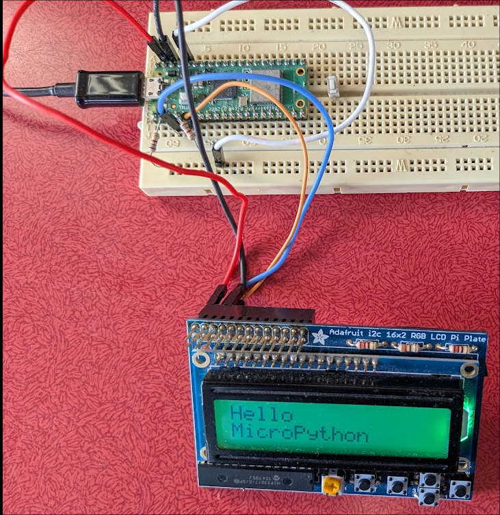
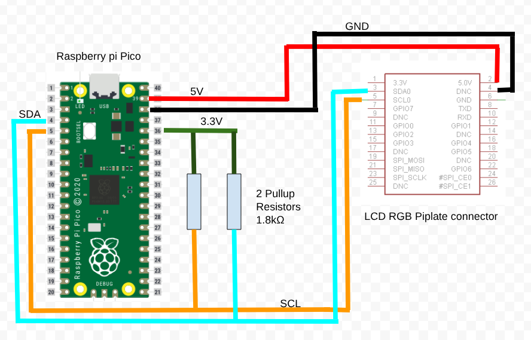

# MicroPython LCD adafruit 16x2 RGB i2c

This is a micropyhon software to drive the Adafruit RGB Positive 16x2 LCD+Keypad Kit for Raspberry Pi.  
It is the [Product id 1109](https://www.adafruit.com/product/1109?srsltid=AfmBOorP_jNHxm4SgWM3a9ulP6mA6EydEmrrQJwzyJ9AP6vjHWgOslV2)  
This device is intended to be used with a Raspberry pi, and works perfectly on it.  
Here we use it on a Raspberry pi Pico (not tested on ESP32 or other devices but should not be difficult).  
There are several micropython drivers for i2c lcd on the web for the Raspberry pi Pico or other micropython devices.
But they all use the PCF8574 i2c chip. Adafruit uses MCP23017. 
In addition to the lcd there are also 5 buttons connected to this MCP23017.
Adafruit provides all the necessary software for it but in CircuitPython, I wanted to use MicroPython.  
So this is inspired by the adafruit library and also, I must say, with some help from Gemini AI.  
Many comments and messages are in French but nothing difficult to understand.  

## Hardware
here is a picture showing the wiring (using i2c1 on GPIO2 & 3)   
The 1.8kΩ pullup resistors are necessary.

   

Wiring diagram    




## Usage
Copy the 2 *py files on your micropython ready Raspberry pi Pico.  
The lcd_Adafruit_16x2_RGB_i2c.py can be placed in the lib folder.  

First thing to do is to import the necessary librairies   

```python
import machine, time
from lcd_Adafruit_16x2_RGB_i2c import MCP23017, Adafruit_RGB_LCD
```

Then initialize the objects    

```python
i2c = machine.I2C(1, sda=machine.Pin(2), scl=machine.Pin(3), freq=400000)
mcp = MCP23017(i2c)
lcd = Adafruit_RGB_LCD(mcp)
```

Now we can use the lcd    

```python
lcd.clear()
lcd.message('Hello world!')
lcd.blink_cursor(1)
```

You can run the TestLcd.py in the REPL to test the LCD and the buttons.  
